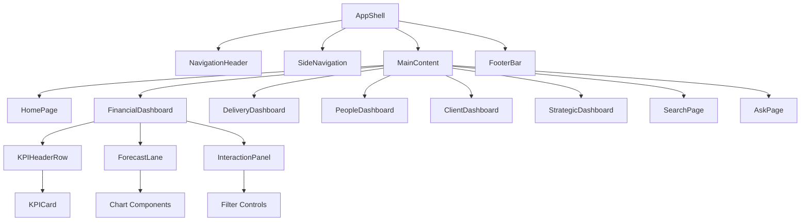
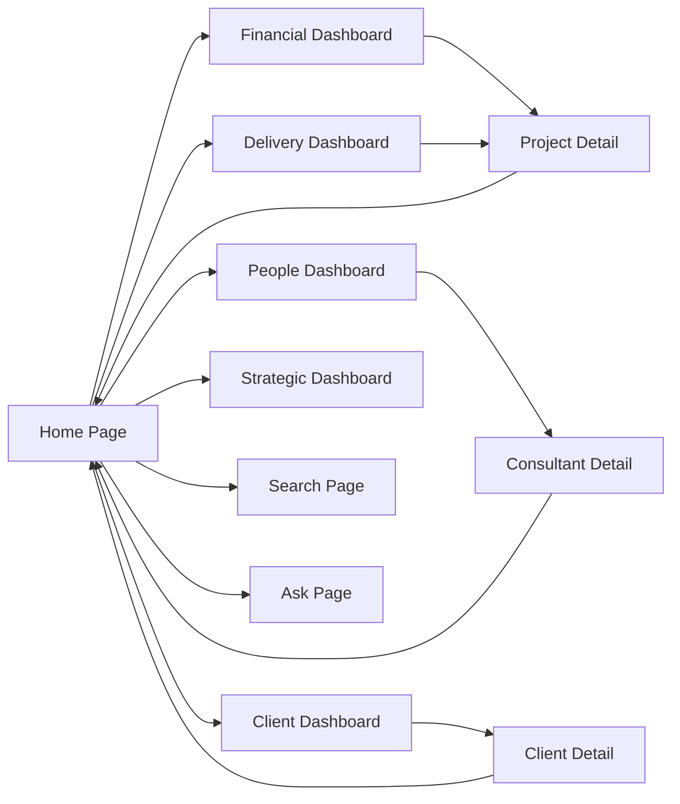

# Consulting Analytics Dashboard - GUI Mockup Design

## Overview

This design outlines the GUI mockup for a comprehensive consulting analytics dashboard featuring domain-specific views for Financial Performance, Delivery & Operations, People & Talent, Client Success, and Strategic/Board metrics. The mockup will be implemented as a clickable HTML prototype demonstrating navigation flows, interactions, and visual layouts without backend connectivity.

## Technology Stack & Dependencies

### Frontend Framework
- **HTML5/CSS3/JavaScript**: Core foundation for mockup prototype
- **CSS Grid & Flexbox**: Responsive layout system
- **Chart.js**: Interactive chart visualization library
- **Font Awesome**: Icon library for UI elements
- **Google Fonts**: Typography (Inter/Roboto family)

### UI Components
- Custom CSS component library following design system
- Responsive grid system (12-column layout)
- Interactive elements with hover/click states
- Modal dialogs and side panels
- Loading states and transitions

## Component Architecture

### Component Definition

#### Core Layout Components
```
AppShell
├── NavigationHeader
│   ├── Logo
│   ├── GlobalSearch
│   ├── UserProfile
│   └── NotificationBell
├── SideNavigation
│   ├── DomainMenuItem (x5)
│   ├── SearchMenuItem
│   └── AskMenuItem
├── MainContent
│   ├── BreadcrumbNav
│   ├── PageHeader
│   └── ContentArea
└── FooterBar
```

#### Domain Dashboard Components
```
DomainDashboard
├── KPIHeaderRow
│   └── KPICard (x5)
├── ForecastLane
│   ├── ForecastChart
│   ├── TrendChart
│   └── WaterfallChart
├── InteractionPanel
│   ├── FilterButtons
│   ├── SegmentToggles
│   └── ExplainVarianceButton
└── DetailVisualization
    ├── HeatmapChart
    ├── LineChart
    ├── StackedAreaChart
    └── TreemapChart
```

#### Interactive Components
```
SearchInterface
├── SearchInput
├── FilterDropdowns
└── ResultsPanel
    ├── KPIResults
    ├── DashboardResults
    ├── ProjectResults
    ├── ClientResults
    ├── PeopleResults
    └── DocsResults

AskInterface
├── NLQInput
├── ExampleQueries
└── AnswerPanel
    ├── SummaryBullets
    ├── LinkedVisuals
    └── ReproducibleQuery
```

### Component Hierarchy



### Props/State Management

#### Global State Structure
```javascript
// Global application state (managed via sessionStorage for mockup)
globalState = {
  currentDomain: 'home',
  activeFilters: {
    timeRange: '12m',
    businessUnit: 'all',
    country: 'all',
    serviceLine: 'all',
    clientTier: 'all'
  },
  navigation: {
    breadcrumb: [],
    activeMenuItem: 'home'
  },
  user: {
    role: 'manager',
    permissions: ['financial', 'delivery', 'people'],
    region: 'nordic'
  }
}
```

#### Component Props Interface
```javascript
// KPICard Props
KPICard = {
  title: string,
  value: string,
  change: number,
  changeType: 'positive' | 'negative' | 'neutral',
  trend: array,
  onClick: function,
  isClickable: boolean
}

// Chart Props
Chart = {
  type: 'line' | 'bar' | 'area' | 'heatmap' | 'treemap',
  data: array,
  config: object,
  height: number,
  interactive: boolean,
  onPointClick: function
}
```

### Lifecycle Methods/Hooks

#### Page Initialization Flow
```javascript
// Page load sequence
1. loadGlobalState()
2. validateUserPermissions()
3. renderNavigationShell()
4. loadDomainContent()
5. attachEventListeners()
6. enableInteractivity()
```

#### Component Update Cycle
```javascript
// Filter change workflow
onFilterChange() {
  updateGlobalState(newFilters)
  showLoadingState()
  simulateDataRefresh()
  rerenderCharts()
  updateKPICards()
  hideLoadingState()
}
```

### Example Component Usage

#### KPI Header Implementation
```html
<div class="kpi-header-row">
  <div class="kpi-card clickable" onclick="filterByRevenue()">
    <div class="kpi-title">Revenue (YTD)</div>
    <div class="kpi-value">€2.4M</div>
    <div class="kpi-change positive">+12.3%</div>
    <div class="kpi-trend">
      <canvas class="sparkline" data-trend="[2.1,2.2,2.3,2.4]"></canvas>
    </div>
  </div>
  <!-- Repeat for 4 more KPI cards -->
</div>
```

## Routing & Navigation

### Page Structure
```
/
├── home (Dashboard hub with domain tiles)
├── financial (Financial Performance domain)
├── delivery (Delivery & Operations domain)
├── people (People & Talent domain)
├── client (Client Success domain)
├── strategic (Strategic/Board domain)
├── search (Search interface)
├── ask (NLQ/GenAI interface)
└── detail
    ├── project/:id
    ├── client/:id
    └── consultant/:id
```

### Navigation Flow


### URL Hash Navigation (for mockup)
```javascript
// Simple hash-based routing for prototype
const routes = {
  '#/': renderHomePage,
  '#/financial': renderFinancialDashboard,
  '#/delivery': renderDeliveryDashboard,
  '#/people': renderPeopleDashboard,
  '#/client': renderClientDashboard,
  '#/strategic': renderStrategicDashboard,
  '#/search': renderSearchPage,
  '#/ask': renderAskPage
}
```

## Styling Strategy

### Design System Foundation
```css
/* Color Palette */
:root {
  --primary-blue: #1f4788;
  --secondary-blue: #4a90a4;
  --accent-orange: #ff6b35;
  --success-green: #28a745;
  --warning-amber: #ffc107;
  --danger-red: #dc3545;
  --neutral-gray: #6c757d;
  --light-gray: #f8f9fa;
  --dark-gray: #343a40;
}

/* Typography Scale */
.text-hero { font-size: 2.5rem; font-weight: 700; }
.text-h1 { font-size: 2rem; font-weight: 600; }
.text-h2 { font-size: 1.5rem; font-weight: 600; }
.text-body { font-size: 1rem; font-weight: 400; }
.text-caption { font-size: 0.875rem; font-weight: 400; }

/* Spacing System */
.spacing-xs { margin: 0.25rem; }
.spacing-sm { margin: 0.5rem; }
.spacing-md { margin: 1rem; }
.spacing-lg { margin: 1.5rem; }
.spacing-xl { margin: 2rem; }
```

### Component-Specific Styles
```css
/* KPI Card Styling */
.kpi-card {
  background: white;
  border-radius: 8px;
  padding: 1.5rem;
  box-shadow: 0 2px 8px rgba(0,0,0,0.1);
  transition: transform 0.2s ease;
}

.kpi-card.clickable:hover {
  transform: translateY(-2px);
  box-shadow: 0 4px 16px rgba(0,0,0,0.15);
  cursor: pointer;
}

/* Chart Container */
.chart-container {
  background: white;
  border-radius: 12px;
  padding: 2rem;
  margin-bottom: 1.5rem;
  box-shadow: 0 2px 12px rgba(0,0,0,0.08);
}

/* Dashboard Grid */
.dashboard-grid {
  display: grid;
  grid-template-columns: repeat(12, 1fr);
  gap: 1.5rem;
  padding: 2rem;
}
```

### Responsive Design
```css
/* Mobile-first approach */
@media (max-width: 768px) {
  .dashboard-grid {
    grid-template-columns: 1fr;
    padding: 1rem;
  }
  
  .kpi-header-row {
    flex-direction: column;
  }
  
  .side-navigation {
    transform: translateX(-100%);
    position: fixed;
    z-index: 1000;
  }
}

@media (min-width: 769px) and (max-width: 1024px) {
  .dashboard-grid {
    grid-template-columns: repeat(6, 1fr);
  }
}
```

## State Management

### Local Storage Schema
```javascript
// Mockup data stored in localStorage
mockupData = {
  kpis: {
    financial: {
      revenue: { value: "€2.4M", change: 12.3, trend: [2.1,2.2,2.3,2.4] },
      grossMargin: { value: "34.5%", change: -2.1, trend: [36,35,34.5] },
      revenuePerConsultant: { value: "€85K", change: 5.8, trend: [80,82,85] },
      averageBillingRate: { value: "€950", change: 1.2, trend: [940,945,950] },
      pipelineCoverage: { value: "78%", change: -5.3, trend: [82,80,78] }
    },
    delivery: {
      billableUtilization: { value: "82%", change: 3.1, trend: [79,81,82] },
      benchPercentage: { value: "12%", change: -1.8, trend: [14,13,12] },
      projectOverrunRate: { value: "8%", change: -2.3, trend: [10,9,8] },
      onTimeDelivery: { value: "94%", change: 2.1, trend: [92,93,94] }
    }
    // ... other domains
  },
  charts: {
    // Mock chart data for visualization
  },
  filters: {
    timeRanges: ["3m", "6m", "12m"],
    businessUnits: ["Cloud", "Digital", "Analytics", "Strategy"],
    countries: ["Sweden", "Norway", "Denmark", "Finland"],
    serviceLines: ["Advisory", "Implementation", "Support"],
    clientTiers: ["Enterprise", "Mid-Market", "SMB"]
  }
}
```

### State Update Patterns
```javascript
// Filter state management
function updateFilters(newFilters) {
  const currentState = getGlobalState();
  const updatedState = {
    ...currentState,
    activeFilters: {
      ...currentState.activeFilters,
      ...newFilters
    }
  };
  setGlobalState(updatedState);
  refreshDashboard();
}

// Navigation state
function navigateTo(domain) {
  updateBreadcrumb(domain);
  setActiveMenuItem(domain);
  loadDomainContent(domain);
  updateURL(domain);
}
```

## API Integration Layer

### Mock API Service
```javascript
// Simulated API calls for mockup
class MockAPIService {
  static async getKPIData(domain, filters) {
    // Simulate network delay
    await this.delay(300);
    
    // Return filtered mock data
    return this.applyFilters(mockupData.kpis[domain], filters);
  }
  
  static async getChartData(chartType, filters) {
    await this.delay(500);
    return this.generateChartData(chartType, filters);
  }
  
  static async searchEntities(query, filters) {
    await this.delay(200);
    return this.mockSearchResults(query);
  }
  
  static async askQuestion(question) {
    await this.delay(800);
    return this.generateAIResponse(question);
  }
  
  static delay(ms) {
    return new Promise(resolve => setTimeout(resolve, ms));
  }
}
```

### Data Transformation Layer
```javascript
// Transform mock data for different chart types
class DataTransformer {
  static toLineChart(data) {
    return {
      labels: data.labels,
      datasets: [{
        label: data.metric,
        data: data.values,
        borderColor: 'var(--primary-blue)',
        backgroundColor: 'rgba(31, 71, 136, 0.1)',
        tension: 0.4
      }]
    };
  }
  
  static toHeatmap(data) {
    return data.map(row => ({
      x: row.team,
      y: row.week,
      v: row.utilization
    }));
  }
}
```

## Testing Strategy

### Manual Testing Checklist
```
Navigation Testing:
□ All menu items navigate correctly
□ Breadcrumb navigation works
□ Back button functionality
□ URL hash updates properly

Interaction Testing:
□ KPI cards clickable and filter correctly
□ Chart points clickable with proper tooltips
□ Filter dropdowns update content
□ Search returns grouped results
□ Ask interface shows mock responses

Responsive Testing:
□ Mobile layout adapts correctly
□ Tablet view maintains usability
□ Desktop layout fully functional
□ Touch interactions work on mobile

Performance Testing:
□ Page loads under 2.5s
□ Chart rendering under 1s
□ Smooth animations and transitions
□ No memory leaks during navigation
```

### User Acceptance Criteria
```
□ Home page renders with 4 domain tiles matching design
□ Each domain shows KPI header with 5 cards
□ Forecast lane displays 3+ interactive charts
□ Global filters persist across domain navigation
□ Search interface returns categorized results
□ Ask interface shows AI-style responses with linked visuals
□ Forecast charts display confidence bands
□ KPI clicks filter charts within 300ms
□ Responsive design works on mobile/tablet
□ All interactive elements have proper hover states
```

### Accessibility Testing
```
WCAG 2.1 AA Compliance:
□ Color contrast ratios meet 4.5:1 minimum
□ All interactive elements keyboard accessible
□ Screen reader compatible with proper ARIA labels
□ Focus indicators visible and logical
□ Skip links available for navigation
□ Error messages use text + icons
□ Chart data accessible via data tables
```

## Implementation Structure

### File Organization
```
mockup/
├── index.html (Main entry point)
├── css/
│   ├── main.css (Global styles)
│   ├── components.css (Component styles)
│   ├── layout.css (Grid and layout)
│   └── responsive.css (Media queries)
├── js/
│   ├── app.js (Main application)
│   ├── navigation.js (Routing logic)
│   ├── charts.js (Chart rendering)
│   ├── data.js (Mock data service)
│   └── interactions.js (Click handlers)
├── assets/
│   ├── icons/ (SVG icons)
│   └── images/ (Screenshots, logos)
└── data/
    └── mock-data.json (Sample datasets)
```

### Progressive Enhancement
```javascript
// Feature detection and graceful degradation
if (typeof Storage !== "undefined") {
  // Use localStorage for state persistence
} else {
  // Fallback to session-only state
}

if (window.IntersectionObserver) {
  // Use lazy loading for charts
} else {
  // Load all charts immediately
}
```

### Performance Optimization
```javascript
// Chart virtualization for large datasets
class VirtualizedChart {
  constructor(container, data) {
    this.container = container;
    this.fullData = data;
    this.visibleRange = { start: 0, end: 100 };
  }
  
  render() {
    const visibleData = this.fullData.slice(
      this.visibleRange.start, 
      this.visibleRange.end
    );
    this.renderChart(visibleData);
  }
}

// Debounced filter updates
const debouncedFilterUpdate = debounce(updateFilters, 300);
```